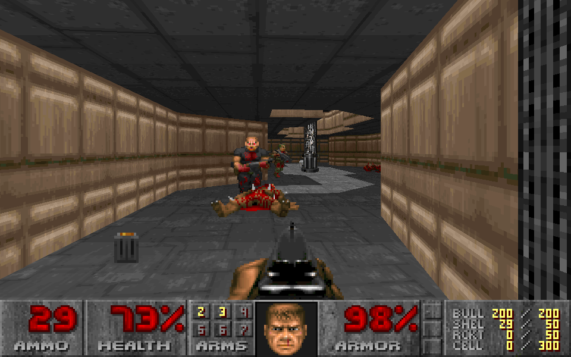

# Mocha Doom

Mocha Doom is a pure Java Doom source port. Most of the hard work of porting Doom to Java has already been done,
thanks to Velktron (Maes) (see [Programming tricks](PROGRAMMING.md) for technical details), but he has stopped working on it in 2013.

Although the port is almost complete, some work remains to do, most importantly the network code for the multiplayer is missing.

This fork of Mocha Doom is intended to support the classic key controls, and provide some pre-compiled binaries for convenience.

## Download

You can find the latest distribution package under the [releases](https://github.com/gaborbata/mochadoom/releases/latest) link.

Mocha Doom can play original variants of Doom. If you don't own any, the easiest way to obtain them is to purchase them from Steam or GOG.
You may also download the freely distributable Shareware version of Doom (also included in this repository) from one of the following links:
* http://cdn.debian.net/debian/pool/non-free/d/doom-wad-shareware/doom-wad-shareware_1.9.fixed.orig.tar.gz
  (extract it and copy the `DOOM1.WAD` file into your Mocha Doom directory).
* https://distro.ibiblio.org/slitaz/sources/packages/d/doom1.wad

## How to run

1. Mocha Doom requires Java, so first of all make sure you have installed Java and please make sure `PATH`,
   or `JAVA_HOME` environment variables point to that installation.
2. Download the latest [release](https://github.com/gaborbata/mochadoom/releases/latest)
   (or [build](https://github.com/gaborbata/mochadoom#how-to-build) a JAR file).
3. Once you have the JAR file, you can run Mocha Doom with one of the following batch/scripts/commands.
   Each script has a `classic` version which launches Doom with classic key controls.

   * Linux
     * `mochadoom.sh`
     * `mochadoom-classic.sh`
   * Windows
     * `mochadoom.bat`
     * `mochadoom-classic.bat`
   * Platform independent
     * `java -jar mochadoom.jar`
     * `java -jar mochadoom.jar -config classic.cfg mochadoom.cfg`

   Mocha Doom tries to find a valid Doom WAD file in the directory
   defined by the `DOOMWADDIR` environment variable (defaults to the current directory).

   If it is not found, you can use the `-iwad` parameter to provide a valid WAD file, e.g.:

   `mochadoom -iwad wads/DOOM1.WAD`.

### Configuration

Check [CONFIG.md](CONFIG.md) for more options.

### Doom with classic controls

You can use `classic.cfg` configuration in order to have the old-school classic key controls.

| Configuration   | Default          | Classic                        |
| --------------- | ---------------- | ------------------------------ |
| key_right       | 77 (right arrow) | 77 (right arrow)               |
| key_left        | 75 (left arrow)  | 75 (left arrow)                |
| key_up          | 17 (W)           | 72 (up arrow)                  |
| key_down        | 31 (S)           | 80 (down arrow)                |
| key_strafeleft  | 30 (A)           | 51 (Alt+left arrow) or comma   |
| key_straferight | 32 (D)           | 52 (Alt+right arrow) or period |
| key_fire        | 29 (Control)     | 29 (Control)                   |
| key_use         | 57 (Space)       | 57 (Space)                     |
| key_strafe      | 56 (Alt)         | 56 (Alt)                       |
| key_speed       | 54 (Shift)       | 54 (Shift)                     |
| use_mouse       | 1 (enabled)      | 0 (disabled)                   |

## How to build

### IDE

1. Open the project with IntelliJ IDEA, Eclipse or NetBeans
2. Build and run the project

### Linux shell scripts

On Linux, two different scripts can be used.

1. `build-and-run.sh` which will build Mocha Doom and run it. You can use it as such:

   `./build-and-run.sh -iwad wads/DOOM1.WAD`.

   This is the preferred way to quickly test changes for developers.

2. `build-jar.sh` which will build a JAR file. You can then run the JAR file as such:

   `java -jar mochadoom.jar -iwad wads/DOOM1.WAD`.

   This is the preferred way for distributing a Mocha Doom executable.

### Gradle

[Gradle](https://gradle.org/) is a cross-platform build tool, which can be also used to run and build Mocha Doom.
First of all, you have to install Gradle following its [installation notes](https://gradle.org/install/).
After that you can use one of the following commands:

* Run Mocha Doom:

  `gradle clean run --args="-iwad wads/DOOM1.WAD"`

* Build a JAR file:

  `gradle clean build`

  This creates a JAR file in the `build/libs/` folder.
  You can then run the JAR file as such:

  `java -jar build/libs/mochadoom.jar -iwad wads/DOOM1.WAD`.

  The build task also creates a distribution package under:

  `build/distributions/mochadoom.zip`

## License

Mocha Doom contains work from many contributors. Here are the main contributors,
but it's no limited to this list. Others are listed in the copyright headers of the files where they own copyright.

- Copyright (C) 1993-1996  [id Software, Inc.](http://www.idsoftware.com/)
- Copyright (C) 2010-2013  [Victor Epitropou](https://sourceforge.net/projects/mochadoom/)
- Copyright (C) 2016-2017  [Alexandre-Xavier Labonté-Lamoureux](https://github.com/AXDOOMER/)
- Copyright (C) 2017  [Good Sign](https://github.com/GoodSign2017)

Mocha Doom is distributed under the [GNU GPLv3 License](https://www.gnu.org/licenses/gpl-3.0.en.html).

Shareware Doom is distributed under the [Doom WAD Shareware License](wads/doom-wad-shareware-license.txt).

## Mocha Doom in action

